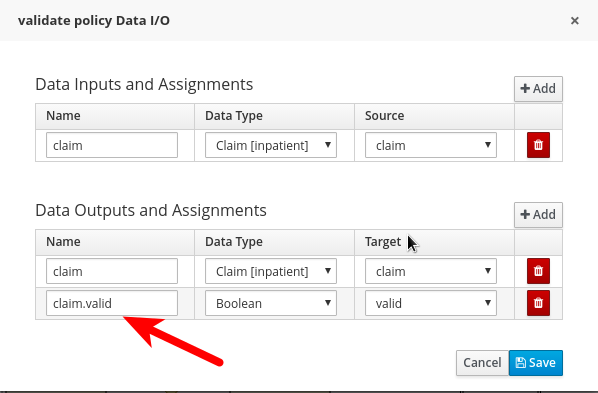

Coding Tips
===========

## MVEL
http://mvel.documentnode.com/


## Variable substitution

There are many place where you can place MVEL expressions.
For example in human task subject field:

    #{varible}

## Variable

    kcontext.setVariable("list",list);

## On exit

    System.out.println(">>> exit: " + kcontext.getNodeInstance().getNodeName());

## Variable Mapping at assignment level

The task assignments are able to perform variable mapping using the MVEL notation.

E.g.:



## Get/Set variable by code

The following interface provides the full access to the variable:

    org.kie.api.runtime.process.WorkflowProcessInstance

This is a code sample:

	WorkflowProcessInstance processInstance = (WorkflowProcessInstance) runtimeEngine.getKieSession().getProcessInstance(processInstanceId);
	processInstance.getVariable(name);
	processInstance.setVariable(name, value);

## Class visibility in Business Central

The file `package-names-white-list` can be used to declare visible packages.
When you declare a package others become invisible to the BC.

The use of this file allows a developer to narrow down the group of facts that are loaded and are therefore, visible. This helps in speeding up the loading of these facts while creating new rules. This file is created automatically on the creation of a new project in the root directory, along with the pom.xml and project.imports project files. For existing projects, you may create this file manually.


## Debugging technique

In order to understand the process actual logic at runtime, you can leverage the event listeners.
There is an already good implementation really useful for debugging purposes.


- Open the deployment descriptors and add an **event listener** entry:

    - Identifier: `org.drools.core.event.DebugProcessEventListener`
    - Resolver: `reflection`
    - Parameters: *none*

You can debug the process placing breakpoints on the event listeners:

- Start the server in debug mode:

        ./standalone.sh --debug

### Check the generated code

In order to debug the java code in the snippet you need to access to the generated code.

There is a system property that force the runtime to dump the code:
`-Ddrools.dump.dir=some/root/dir`


## XStream utility

Constructor

	XStream xStream = new XStream();
	xStream.fromXML(xml, this);

String

	public String toString() {
		XStream xStream = new XStream();
		return xStream.toXML(this);
	}

## EJB client

	<properties>
		<version.bpms>6.4.0.Final-redhat-6</version.bpms>
	</properties>

(...)

		<dependency>
			<groupId>org.jbpm</groupId>
			<artifactId>jbpm-services-ejb-client</artifactId>
			<version>${bpm.version}</version>
			<scope>runtime</scope>
		</dependency>

## Trigger a process from an other process / rule

To start a process from within a process instance you can use code
like this (not sure you can use this from within a rule, never tried
this):

```
    RuntimeManager rm =
    RuntimeManagerRegistry.get().getManager(deploymentId);
    RuntimeEngine engine = rm.getRuntimeEngine(EmptyContext.get());
    KieSession ksession = engine.getKieSession();
    try {
        ksession.startProcess(processId, paramMap);
    } finally {
        rm.disposeRuntimeEngine(engine);
    }
```

Inside a kieserver:

```
    KieServerImpl kieServer = KieServerLocator.getInstance();
    KieServerExtension ext = ((KieServerImpl)kieServer).getServerRegistry().getServerExtension("jBPM");
    ProcessService processService = (ProcessService) ext.getServices().stream().filter(service -> service instanceof ProcessService).findFirst().get();
    Map<String, Object> paramMap = new HashMap<>();
    paramMap.put("eventId", eventId);
    processService.startProcess(deploymentId ,processId, paramMap);
```

Import dependencies using `provided` for the scope.

```
    <dependency>
      <groupId>org.kie</groupId>
      <artifactId>kie-api</artifactId>
      <scope>provided</scope>
      <optional>true</optional>
    </dependency>
```

**Optional** tag should avoid the propagation of the dependency in chain. Not sure if it has impact on kieserver runtime.

## Insert Variable in Working Memory of a Process 

Example

    kcontext.getKnowledgeRuntime().insert( application );

## Multi thread tolerance

During the development of BRMS 6.3 and 6.4, the engine was redesigned to better coordinate different threads (both created by user and internal to the engine itself) accessing a KieSession. In particular, they simplified the concurrency model of the engine, with the introduction of that state machine, and this allow to both increase performances in multithreaded environments and be more confident about the robustness of the engine in heavily concurrent use cases.

KieBase and KieSession have been designed to be thread-safe.
Dynamic changes to a KieBase are now coordinated with the state machines of the KieSessions formerly created by the same KieBase, so also incremental compilation can be considered thread-safe.

KieSessions can be shared between different threads.

It's better to avoid the execution of long and blocking operations inside the RHS but this is not related with thread-safety. This only related to performance reasons, because also the invocation of a RHS is blocking and synchronous, so having a particularly slow RHS will have the effect of slowing down the whole engine.

KieSession is single threaded (v7 introduces multi-threading capabilities). So any blocking operation in the RHS blocks the full session and all the rule evaluation in that session. So blocking operations in the RHS essentially kills performance of your rules engine.

## Timers

since version 6 timers can be configured with valid ISO8601 date format that supports both one shot timers and repeatable timers. Timers can be defined as date and time representation, time duration or repeating intervals

- Date - 2013-12-24T20:00:00.000+02:00 - fires exactly at Christmas Eve at 8PM
- Duration - PT1S - fires once after 1 second
- Repeatable intervals - R/PT1S - fires every second, no limit, alternatively R5/PT1S will fire 5 times every second

### Duration format

 - `P3Y6M4DT12H30M5S` represents a duration of "three years, six months, four days, twelve hours, thirty minutes, and five seconds".
 - `P2D` represents 2 days

[Wikipedia duration standard format](https://en.wikipedia.org/wiki/ISO_8601#Durations)

