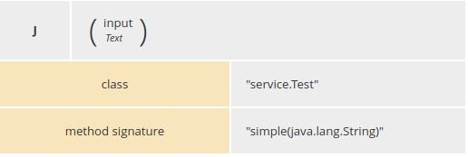

# Decision Modelling Notation (DMN)

**Red Hat Decision Manager V7** implements DMN v1.1 (Compliance Level 3).

**Red Hat Process Automation Manager V7** makes possible to leverage DMN in the context of a BPMN process.

## Useful external source of information (Blogs and videos)

For a first introduction to the DMN here some resources:

- [Capture your decisions with DMN](http://www.opensourcerers.org/capture-your-decisions-with-dmn/)
- [Standards in Business Rules Space: Decision Model and Notation (DMN) and Other Standards](https://youtu.be/fXYD_HE7ufc)
- [Building Business Applications with DMN and BPMN](https://youtu.be/C0u3ZDiH3ek)

## Project dependencies

```xml
<!-- Required for the DMN runtime API -->
<dependency>
  <groupId>org.kie</groupId>
  <artifactId>kie-dmn-core</artifactId>
  <version>${drools.version}</version>
</dependency>

<!-- Required if not using classpath KIE container -->
<dependency>
  <groupId>org.kie</groupId>
  <artifactId>kie-ci</artifactId>
  <version>${drools.version}</version>
</dependency>
```

## FEEL Language

### Data Types

Basic data types: string, Boolean, Number, date, time and duration

You can express complex data types in DMN or importing XSD definitions.

E.g. 

```
 <itemDefinition label="tBid" name="tBid">
    <itemComponent id="..." name="id">
      <typeRef>feel:string</typeRef>
    </itemComponent>
    <itemComponent id="..." name="quotation">
      <typeRef>feel:number</typeRef>
    </itemComponent>
    <itemComponent id="..." name="deliveryTime">
      <typeRef>feel:number</typeRef>
    </itemComponent>
  </itemDefinition>
  <itemDefinition isCollection="true" label="tBids" name="tBids">
    <typeRef>tBid</typeRef>
  </itemDefinition>
  <inputData id="..." name="Suppliers bids">
    <variable id="..." name="Suppliers bids" typeRef="tBids"/>
  </inputData>
```

In the previous example there are:

1. `tBid` type definition: 

    - id - string
    - quotation - number
    - deliveryTime - number

2. `tBids` is a collection of `tBid`

3. `Suppliers bids` is a variable defined as `tBids`


### Path Expressions

FEEL is able to query data in a sophisticated way with constructs that recall closely XPATH 2.0.

### Dot to navigate the data structure

As many other languages the dot (".") is used to access to the nested data structure (JavaScript, Python).

E.g.

Let's consider the following variable Bid which type was described before:

```
<variable id="..." name="Bid" typeRef="tBid"/>
```

`Bid.id` retrieve the `id`

But if the type is a **collection**, the result is a collection with all the ids.

Example of Suppliers Bids:

|    id    | quotation |  deliveryTime |
|----------|:---------:|--------------:|
|    1     |    100    |      2        |
|    2     |    120    |      1        |
|    3     |    80     |      4        |

In this case the expression `Suppliers Bids.id` retrieve a list of values:

|    id    |
|----------|
|    1     |
|    2     |
|    3     |


```
Suppliers bids[ quotation = lower quotation].id
```

### List functions

This functions applies to lists.

There are functions that summarize the data: `count, min, max, sum, mean, and, or, list contains`.

E.g.

```
min(Suppliers bids.quotation)
```

Other list function manipulate the list.

<table>
  <tr>
    <th>Name(parameters)</th> <th>Parameter Domain</th> <th>Description</th> <th>Example</th>
  </tr>
  <tr>
    <td>count(list)</td>
    <td>list</td>
    <td>return size of list</td>
    <td>count([1,2,3]) = 3</td>
  </tr>
  <tr>
    <td>list contains(list, element)</td>
    <td>list, any element of the semantic domain including <b>null</b></td>
    <td>does the list contain the element?</td>
    <td>list contains([1,2,3], 2) = true</td>
  </tr>
  <tr>
    <td>min(list)<br>
        min(c1 ,..., cN ), N>1 <br>
        max(list) <br>
        max(c1 ,..., cN ), N>1
    </td>
    <td>(list of) comparable items</td>
    <td>return minimum(maximum) item</td>
    <td>min([1,2,3]) = 1<br>
        min(1,2,3) = 1<br>
        max([1,2,3]) = 3<br>
        max(1,2,3) = 3</td>
  </tr>
</table>

## Boxed Function implemented in Java

A Boxed Function Definition is the way to define function in DMN. 
In the Trisotech editor, it is "Function (Expression)".

There are 3 possible implementations (kinds): FEEL, PMML and Java.

This is the way to define a Java function:



## Time handling

FEEL extension to evaluate time:

- `now()` : Returns the current local date and time.

- `today()` : Returns the current local date.

**Warning** Using this functions in different point of a decision could give different results base on the real evaluation execution time.


### Duration

Subtracting two dates gives a duration:

	date1 - date2

Duration operations:

	days, hours, minutes, seconds

Example: days between two dates

	(date1 - date2).days

## Debugging

logs (tipo org.kie=DEBUG)
 
 	DMNRuntimeEventListener

[https://github.com/kiegroup/drools/blob/master/kie-dmn/kie-dmn-api/src/main/java/org/kie/dmn/api/core/event/DMNRuntimeEventListener.java#L21-L31]()

add to DMNRuntime

	DMNRuntime.addListener( DMNRuntimeEventListenerImpl )
