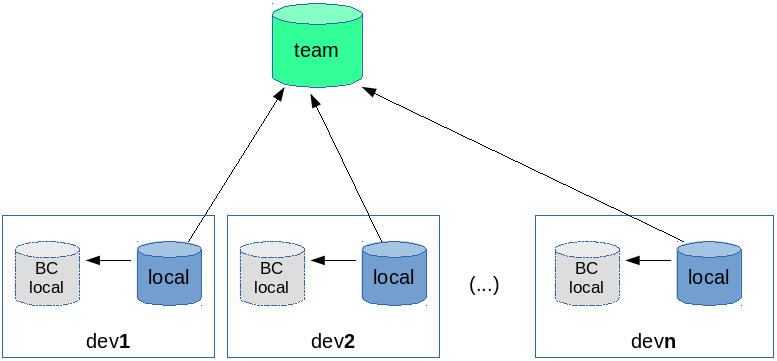
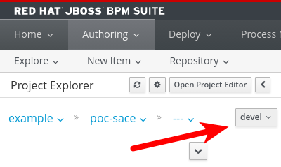
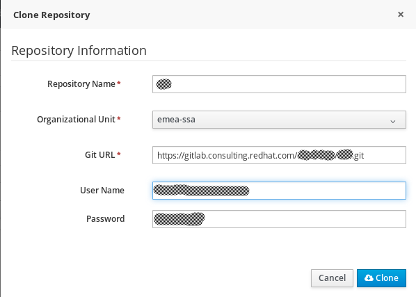

# Advanced Git workflow for Red Hat JBoss BPM Suite

## Introduction

The following document aims to provide an isolated development environment for each BPM developer.

There are two options:

1. each developers has his own instance of Business Central in his/her own workstation;
2. the Business Central is shared on a development server, but each developer has to work on his/her own branch. In this case, developers have to pay attention to stay on their own branch, when they perform any change.

The Business Central (BC) repository has the role of a sandbox, where many commits are meaningless. It's worth mentioning that the BC performs a git commit every time a developer saves an artefact. Conversely, a developer should __commit__ a group of artefacts when they are consistent, usually when he implement a new feature, he can build the code and has performed a first test.

The team shares the consolidated work in a shared git repository, let's call it "team" (_blessed repository_ Ref. [Distributed Git - Distributed Workflows](https://git-scm.com/book/en/v2/Distributed-Git-Distributed-Workflows)).

In this simple model each developer has his/her private git repository, where he/she pull from BC repository and push the team repository. It's highly recommended that the developer squash the BC commits, in order to pour in the team repository only consistent commits.



** WARNING ** Except for really simple cases, the graphical assets cannot be merged (BPMN diagram, forms, etc). So it's crucial that developers adhere to a strict discipline to avoid that the same artefact is modified in parallel (Only one developer is responsible for a BPMN diagram).

## SSH set up

To use git with the ssh protocol against *Business Central* you have to tweak your ssh config.
Add the following lines to `~/.ssh/config`

    Host *
            VerifyHostKeyDNS no
            StrictHostKeyChecking no
            HostKeyAlgorithms +ssh-dss
            PubkeyAcceptedKeyTypes +ssh-dss
            UserKnownHostsFile /dev/null

Ensure that `~/.ssh/config` has these access rights: `-rw-------`

    chmod 600 ~/.ssh/config


## Central Git repository set up
There are many public available git repository that can host your project.
(e.g. `github.com` or `http://gitlab.com`)

Each developer must to create and set up his/her account:

- username and password on the remote system 
- ssh certificate

Remember to configure your identity for the shared env:

    git config --global user.name "Your Name"
    git config --global user.email "yourmail@example.com"

## Project set up for first developer (the repository creator)

The first developer create a repository in his/her BC then clone it locally and push it to the central git repository.
Each developer create and work only in his/her own branch.

1. Create a repository in BC
2. Clone it locally 

    ```
    $ git clone ssh://127.0.0.1:8001/<repo_name>
    ```
    
3. Create and checkout your branch (each developer has its own branch)

    ```
    $ git checkout -b <dev1_branch>
    ```

4. Push the new branch in the BC repo (origin)

    ```
    $ git push origin <dev1_branch>
    ```

    If you find problem pushing, you can try the *force* option: `git push --all -f`

5. Restart the BPMS in order to reload the new repository structure


6. In the BC select your branch, this operation will ensure that your next changes will stored on the your branch.

    

    *Note: if you cannot see the new branch in the Project Explorer, try to select again tree structure (from org unit)* 
    
    **Warning** The Business Central in the authoring perspective remember the last branch selected. Avoid as much as possible switching branch, since it's likely that you forget the branch switch and commit on the wrong branch. if it happens later it is described an emergency procedure to remove wrong commits from master branch.
    
7. Add the centralized git repository (e.g. `https://gitlab.com/<user>/<project>.git`)

    ```
    $ git remote add team <team_repo_url>
    ```
    
8. Push the master branch to the centralized structure

        $ git push -u team master
        Warning: Permanently added 'gitlab.com,x.x.x.x' (ECDSA) to the list of known hosts.
        Counting objects: 38, done.
        Delta compression using up to 4 threads.
        Compressing objects: 100% (26/26), done.
        Writing objects: 100% (38/38), 7.84 KiB | 0 bytes/s, done.
        Total 38 (delta 9), reused 38 (delta 9)
        To gitlab.com:<user>/<repo-name>.git
         * [new branch]      master -> master
        Branch master set up to track remote branch master from team.

    *Note: your working branch <dev_branch> is not replicated in the centralized repository. This is fine, because your local branch is full of useless commits.*
    
## Project set up for other developer

Other developer should create the repository in their Business Central environment then add their own branch.

1. Clone the centralized repository

    

2. Clone it locally 

    ```
    $ git clone ssh://127.0.0.1:8001/<repo_name>
    ```
    
3. Create and checkout your branch (each developer has its own branch)

    ```
    $ git checkout -b <dev2_branch>
    ```

4. Push the new branch in the BC repo (origin)

    ```
    $ git push origin <dev2_branch>
    ```

    If you find problem pushing, you can try the *force* option: `git push -f origin <dev2_branch>`

5. Restart the BPMS in order to reload the new repository structure

6. In the BC select your own branch ("devel" in the picture), this operation will ensure that your next changes will stored on the your branch.

    

    *Note: if you cannot see the new branch in the Project Explorer, try to select again tree structure (from org unit)* 
    
7. Add the centralized git repository (`https://gitlab.consulting.redhat.com/dmarrazz/elsevier.git`)

        $ git remote add team <team_repo_url>
    
8. You can check that your git is correctly set up


        $ git remote show team  
        * remote team
          Fetch URL: https://gitlab.consulting.redhat.com/<your_project>
          Push  URL: https://gitlab.consulting.redhat.com/<your_project>
          HEAD branch: master
          Remote branch:
            master new (next fetch will store in remotes/team)
          Local ref configured for 'git push':
            master pushes to master (up to date)
    

## Usual workflow
Let's use `master` branch for consolidated commits.
When your work needs to be shared (at least you are able to get a clean built):


1. Switch to master in order to merge there your work on the development branch
    
        git checkout master # switch to the master branch

2. Get changes from internal git server and remote server

        git fetch --all 

    **Warning:** be sure that no updates come from central repository otherwise, merge those updates in your development branch than continue with this flow.
    
3. Merge all your personal changes adding just 1 commit to master (squashing all useless commit from dev's branch)

        git merge --squash <dev1_branch>
    
4. If you find conflict use usual git procedure to manual merge the code.
5. Commit your work with a comment

        git commit -m "comment about latest update"

6. Send the merged work to the central repository

        git push team master

At this point, your dev branch will be completely separated from the master. E.g.

        ------------ X (master)
      /
     /
    a --- b --- c (devN_branch)

If you prefer to continue on top of the master commit, you have to merge it in your dev branch.
This operation will remove from the development branch all the intermediate commit.

1. Switch to dev branch

        git checkout <devN>

2. Merge the master

        git merge master

3. Push to your local BC

        git push -f --all origin

This is the result:

    a------------ X (master, devN_branch)


**Pay Attention:** BPMN diagram are almost impossible to merge, so **BE SURE** that just one person per time works on a specific process diagram.

## Git tips

### A clean history

A good practice is keeping your commit history clean: so you can find the changes you made and the reason for that changes.
So in order to compact your git history, you can use `git rebase`.

Let's consider the following history:

    a --- b --- c --- e --- f --- g --- h 

You want to compress the commits between `b` and `h`. There are 2 way to achieve this:

#### Squashing

Use the following command: `git rebase -i <commit hash of b>`

Git will present you an editor to *interactively* select the commit to **squash**.

E.g.

    ```
    pick 0d04918 Created asset patterns.json {/barcellona20180115/global/patterns.json}
    pick 5fcade4 {/readme.md}
    pick ec079c7 {/DMNTest/src/main/java/model/Person.java}
    pick 31c96f6 remoatable
    pick 2861c2a no remo
    pick c0dba06 test change
    ```

    
In order to squash the unwanted commits, you have to change `pick` in `squash` (or just `s`). Hence, you can save and exit.

#### Create a new commit 

This is an alternative approach:

1. Move the HEAD to the last consolidated commit (b)

        git reset --soft <commit hash of b>

2. Stage all the changes

        git add -A

3. Create a new commit

        git commit -m "all changes from b to h"
    

### Emergency procedure to remove unwanted commit

If a developer performed some unwanted updates on the master branch, he can recover a clean situation with the following procedure:

    git fetch origin

The log should appear as in the following diagram, where X,Y and Z are the unwanted commits:

    a --- b --- c (master) --- X --- Y --- Z (origin/master)

Optionally, if you want to save this work, move the change to the development branch:

    git checkout <devN>
    git merge origin/master
    git push origin <devN>

Force the override of local master to BC:

    git push -f origin master

Now, your git log should look so:

    a --- b --- c (master, origin/master) --- X --- Y --- Z (devN, origin/devN)


### Don't type your password every time

    git config --global credential.helper 'cache --timeout=2628000'

The previous method does not work with the git implementation in the Business Central.
So in order to auto-type the password you can use the following script:

```
#!/usr/bin/expect

set timeout 13
# set password [lindex $argv 0]
set password "donato"
set command --
if {[llength $argv] == 1} {
	set command [lindex $argv 0]
}
spawn git push $command
expect {
    "(yes/no)?"
        {
            send "yes\n"
            expect "*assword:" { send "$password\r"}
        }
    "*assword:"
        {
            send "$password\r"
        }
    }
expect eof
```


