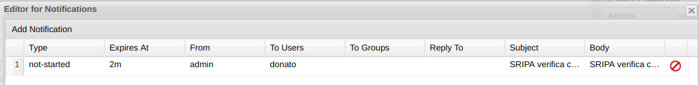

Human Tasks
=============================================================================

## Properties
Syntax to add variables in **subject** or **description**

E.g.

    Escalation for Artwork Processing #{defaultDataInput}

In a multi instance loop the human task description can access to the instance data: ``#{miDataInputX}``

## Authentication

Users are listed in the following file:

    <EAP_HOME>/standalone/configuration/application-users.properties

Roles are defined in the following file:

    <EAP_HOME>/standalone/configuration/application-roles.properties

It's possible to override the authenticated user, performing all task operation declaring a different users than the authenticated.
The following property affect the kieserver:

```xml
    <property name="org.kie.server.bypass.auth.user" value="true"/> 
```

In such way, the authentication is bypassed and the userid can be overridden.


## Custom UserGroupCallback

User/group information obtained via callbacks

Callback = implementation of interface

- org.kie.api.task.UserGroupCallback
- org.kie.internal.task.api.UserInfo


UserGroupCallback methods are:

    boolean existsUser (String userId);
    boolean existsGroup (String groupId);
    List<String> getGroupsForUser (String userId);


### Default Users information

The default implementation [DefaultUserInfo](https://github.com/kiegroup/jbpm/blob/6.5.x/jbpm-human-task/jbpm-human-task-core/src/main/java/org/jbpm/services/task/identity/DefaultUserInfo.java) reads the configuration from:

    EAP_HOME/standalone/deployments/business-central.war/WEB-INF/classes/userinfo.properties

Example content:

    Luke\ Cage=luke@domain.com:en-UK:luke

It can be changed in `EAP_HOME/standalone/deployments/business-central.war/WEB-INF/beans.xml`

DefaultUserInfo implements [UserInfo](https://github.com/kiegroup/droolsjbpm-knowledge/blob/master/kie-api/src/main/java/org/kie/api/task/UserInfo.java) methods:

    String getDisplayName (OrganizationalEntity entity);
    Iterator<OrganizationalEntity> getMembersForGroup (Group group);
    boolean hasEmail(Group group);
    String getEmailForEntity (OrganizationalEntity entity);
    String getLanguageForEntity (OrganizationalEntity entity);


## User Assignment

Instead of using the task properties pane, user assignment can be done using Task input parameters:

 - ActorId
 - GroupId
 - BusinessAdministratorId: users that can manage the task life cycle, change it reassign. 
 - BusinessAdministratorGroupId
 - TaskStakeholderId: can view and modify the task (not claiming, etc)
 - ExcludedOwnerId: users that cannot see and perform the task
 - RecipientId: notification receiver

By default the user task administration is in charge of user: `Administrator` and group `Administrators`.
This configuration can be changed using the following system properties:
 - org.jbpm.ht.admin.user
 - org.jbpm.ht.admin.group

The user that started the process instance can be retrieved using the process variable `initiator`.
In order to statically refer it, declare it in the process definition: `initiator` as `String`.

## User Distribution

it's possible to define a strategy for user distribution.
One of the most common practice is distribute the task according the workload: the user with less task assigned will receive the new task.

References:

[http://mswiderski.blogspot.com/2017/01/distribute-tasks-wisely-pluggable-task.html]()

[https://access.redhat.com/solutions/3714251](How to configure human task assignment logic, using PotentialOwnerBusyness, BusinessRule or RoundRobinin strategy in RHPAM 7?)

### References

- jbpm-human-task/jbpm-human-task-workitems/src/main/java/org/jbpm/services/task/wih/util/PeopleAssignmentHelper.java
- jbpm-human-task/jbpm-human-task-core/src/main/resources/operations-dsl.mvel

## Due date

It's possible to specify a `DueDate` as parameter following ISO standard duration format.

Examples:

 - 3 hours, 30 minutes: 3H 30M
 - 1 day: 1D
 - 1,500 milliseconds: 1500MS
 - `P3Y6M4DT12H30M5S` represents a duration of "three years, six months, four days, twelve hours, thirty minutes, and five seconds".

Same format used in **Expiry Delay**:

Regular expression: `([+-])?((\\d+)[Dd])?\\s*((\\d+)[Hh])?\\s*((\\d+)[Mm])?\\s*((\\d+)[Ss])?\\s*((\\d+)([Mm][Ss])?)?`


[Wikipedia duration standard format](https://en.wikipedia.org/wiki/ISO_8601#Durations)

## Swim lane assignment

The second task in the swim lane is assigned to the same user that performed the previous task.

[AbstractHTWorkItemHandler AutoClaim](https://github.com/kiegroup/jbpm/blob/6.5.x/jbpm-human-task/jbpm-human-task-workitems/src/main/java/org/jbpm/services/task/wih/AbstractHTWorkItemHandler.java#L218)

When you use JAAS Identity Provider, auto claim does not work if the previous task was out of the swimlane (it was performed by another user): in the log you'll find a permission error:

    WARN  [org.jbpm.services.task.wih.LocalHTWorkItemHandler] (default task-22 ) User ... is not allowed to auto claim task due to permission violation

This is caused by the fact that JAASUserGroupCallbackImpl can retrieve groups just for a logged user.
This usually is not a problem in a production environment where you rely on other identity providers (e.g. LDAP).
To test the capability in a development environment, there are 2 possible workarounds:

1. Configure the user registry to leverage a property file
2. Change the process to set the `Actors` to `#{SwimlaneActorId}` for all the Human Task that follow the first one in the swim lane.

## Delegating or Forwarding

- **Forward** operation forwards the task to another organization entity. The WS-HumanTask Client MUST specify the receiving organizational entity. Potential owners MAY forward a task while the task is in the Ready state.

- **Delegate** operation assigns the task to one user and set the task to state Reserved. If the recipient was not a potential owner then this person MUST be added to the set of potential owners.

In short, from the practical point of view. Delegate is to change the task owner. Forward is to remove one user and add another user in PotentialOwner.

Further information in [Human Task specification](http://docs.oasis-open.org/bpel4people/ws-humantask-1.1-spec-cs-01.pdf)

See [https://access.redhat.com/solutions/784453]()

## User Registry 

RHPAM security is based on the underling Application Server security (JAAS). 
In the basic configuration the Human Task Manager relies on the same user registry, there are some limitation of this configuration:

- user lacks of some information: the locale, the email address and the extended name
- groups are implemented using JAAS roles, so the group structure is flat.
- for security reason, it is not possible to enquire freely the user / group relationship  

This configuration could be sufficient in some basic scenarios, but those, who want to exploit the full capabilities of the Human Task Manager, have to rely on one the following configurations:

 - LDAP
 - DB
 - Custom
 
For development / testing purposes are available even:

 - Properties
 - MVEL
 
The configuration relies on the following system properties:

 - `org.jbpm.ht.callback` that can accept the following values: `ldap`, `db`, `mvel`, `props`, `jaas`, `custom`
 - `org.jbpm.ht.userinfo` that can accept the following values: `ldap`, `db`, `props`, `custom`

When `custom` is selected, the following further system properties are required:

 - `org.jbpm.ht.custom.callback` the class name of the custom implementation of the `UserGroupCallback`
 - `org.jbpm.ht.custom.userinfo` the class name of the custom implementation of the `UserInfo`

### Property based identity provider

This configuration is useful for demo / development environment:

```
<property name="org.jbpm.ht.callback" value="props"/>
<property name="org.jbpm.ht.custom.userinfo" value="props"/>
<property name="jbpm.user.info.properties" value="classpath:/userinfo.properties"/>
```

The property callback is implemented by `JBossUserGroupCallbackImpl` class
and expects this file `roles.properties` in the default application server config dir (System property: `jboss.server.config.dir`).

The format of this file is as follows:

	username=role1,role2,role3

By default the user information file is expected in the kieserver WEB-INF/classes dir.
Constructs default UserInfo implementation to provide required information to the escalation handler.
following is the string for every organizational entity

	entityId=email:locale:displayname:[member,member]

members are optional and should be given for group entities


Example:

```
john=john@domain.com:en-UK:john
mary=mary@domain.com:en-UK:mary
krisv=krisv@domain.com:en-UK:krisv
Administrator=Administrator@domain.com:en-UK:Administrator

Crusaders=Crusaders@domain.com:en-UK:Crusaders:[Luke Cage,Bobba Fet,Tony Stark]
Knights\ Templer=Crusaders@domain.com:en-UK:ACrusaders:[Bobba Fet]
Wrong\ Crusaders=WrongCrusaders@domain.com:en-UK:Wrong Crusaders:[Darth Vader]
Nobodies=nobodies@domain.com:en-UK:Nobodies:[]
```


### MVEL Callback Implementation

Through mvel callback implementation is possible to provide user

Version 6.x Business Central runtime:

- In Business central you have to edit CDI config `<EAP_HOME>/standalone/deployments/business-central.war/WEB-INF/beans.xml`

    <alternatives>
        <class>org.jbpm.services.cdi.producer.DefaultUserGroupInfoProducer</class>
    </alternatives>

In version 7, the runtime is hosted in the kieserver:

- In kieserver, add this system property:

	<property name="org.jbpm.ht.callback" value="mvel"/>

- then add this file `<runtime_war>/WEB-INF/classes/org/jbpm/services/task/identity/UserGroupsAssignmentsOne.mvel`

```
    usersgroups = [
            new User('donato') : [new Group( "developer" ), new Group( "manager" ), new Group( "Administrators" )],
            new User('supplier1') : [new Group( "user" ), new Group( "supplier" )],
            new User('supplier2') : [new Group( "user" ), new Group( "supplier" )],
            new User('supplier3') : [new Group( "user" ), new Group( "supplier" )],
          ];
          
    return usersgroups;
```

## Database authentication

1. Create a custom tables to store user data :

You need to create custom table which will store the user details like password and roles/groups.
Please find below sample create table query which I have used.

```sql
create table USERS (username varchar(20), password varchar(20));
create table ROLES (username varchar(20), user_role varchar(20));
```
2. Create a custom security domain :

You need to create your custom security domain which will fetch the user details from the database.
Please add below custom security domain in your standalone*.xml file.

```xml
<security-domain name="testDB">
<authentication>
<login-module code="Database" flag="required">
<module-option name="dsJndiName" value="java:/MySqlDS"/>
<module-option name="principalsQuery" value="select password from USERS where username=?"/>
<module-option name="rolesQuery" value="select user_role, 'Roles' from ROLES where username=?"/>
</login-module>
<login-module name="KieLoginModule" code="org.kie.security.jaas.KieLoginModule" flag="optional" module="deployment.business-central.war"/>
</authentication>
</security-domain>
```

Once you add this security domain, then add the security domain mapping in the jboss-web.xml file in both business-central.war and kie-server.war file.
You can find the jboss-web.xml file at path : `JBOSS_HOME/standalone/deployments/business-central.war/WEB-INF/jboss-web.xml` and
`JBOSS_HOME/standalone/deployments/kie-server.war/WEB-INF/jboss-web.xml`

Please refer below example with respect to above security domain.
```xml
<security-domain>testDB</security-domain>
```

By default the value for this is "other". You need to change it to your custom security domain name. Please make sure you will keep only one security domain configuration in jboss-web.xml file.
Also add the username and password for process server in standalone*.xml. This user should have the kie-server role assigned.
Add below system properties in you standalone*.xml file.

```xml
<property name="org.kie.server.controller.user" value="testUser"/>
<property name="org.kie.server.controller.pwd" value="admin@123"/>
```
My testUser has the admin and kie-server role already assigned.

3. Add JNDI and user fetching details for user info :

This configuration is required as we are making the custom authentication so it will help us to get the user details while task assignment.
You need to add the datasource JNDI and user query in `JBOSS_HOME/standalone/deployments/kie-server.war/WEB-INF/classes/jbpm.user.info.properties`.
Add below properties in `jbpm.user.info.properties` file.

```s
db.ds.jndi.name=java:/MySqlDS
db.group.mem.query=select user_role, 'Roles' from ROLES where username = ?
```

This jndi value should be the same value which you used in custom security domain.

4. Configure user group callback 

set system property `-Dorg.jbpm.ht.callback=db`
create file named `jbpm.usergroup.callback.properties` in the root of the class path (/JBOSS_HOME/standalone/deployments/kie-server.war/WEB-INF/classes/)
define your queries and data source:

- db.ds.jndi.name - JNDI name of the data source to be used for connections</li>
- db.user.query - query used to verify existence of the user (case sensitive, expects a single parameter on position 1)
- db.roles.query - query user to check group existence (case sensitive, expects single parameter on position 1)
- db.user.roles.query - query used to collect group for given user (case sensitive, expects single parameter on position 1, retrieves group name from position 1 of returned result set)


4. Add bypass user authentication and usergroup call back property in standalone-full.xml :

```xml
<property name="org.jbpm.ht.callback" value="DB"/>
<property name="org.kie.server.bypass.auth.user " value="true"/>
```


## Assignment Rules

Assignment rules are rules executed automatically when a Human Task is created or completed. This mechanism can be used, for example, to assign a Human Task automatically to a particular user of a group or prevent a user from completing a Task if data is missing.

Create a file that will contain the rule definition on the Business Central classpath (the recommended location is DEPLOY_DIR/standalone/deployments/business-central.war/WEB-INF/classes/):

default-add-task.drl with the rules to be checked when the Human Task is created
default-complete-task.drl with the rules to be checked when the Human Task is completed

[TaskServiceRequest](https://github.com/kiegroup/jbpm/blob/master/jbpm-human-task/jbpm-human-task-core/src/main/java/org/jbpm/services/task/rule/TaskServiceRequest.java)


## Special Groups

The user `Administrator` and all users in the group `Administrators`, can see and manage all the task. (This name can be configure through these system properties: `org.jbpm.ht.admin.user`, `org.jbpm.ht.admin.group`.

In order to define a specific administration group for a task, the developer has to define either `BusinessAdministratorId` or `BusinessAdministratorGroupId` as task input parameter.

If a task define the `ExcludedOwnerId`, this user is removed by the potential owner list.

## Notifications

Example of notification configuration:



Tech note on how to define a custom notification listener:
https://access.redhat.com/solutions/885393

This is the interface, where you have many information about the task the passed the deadline:
https://github.com/kiegroup/jbpm/blob/master/jbpm-human-task/jbpm-human-task-core/src/main/java/org/jbpm/services/task/deadlines/NotificationListener.java

A possible library to implement HTML templates:

https://freemarker.apache.org/

## Boundary events

[Task details in boundary events](https://issues.redhat.com/browse/BAPL-1568)

## 4 eye principle

And why not to rely on potential owners and excluded owners that come with WS-HT spec that we do have support for?

the first task that is completed returns `ActorId` data output that represents the actual onwer who completed the task, then map this to variable and use on next task as excluded owner (via data input mapping, parameter name: `ExcludedOwnerId`) so when you query for tasks (via task service queries that take into consideration excluded owners) you won’t see that task and thus won’t be able to work on it.

[https://github.com/droolsjbpm/jbpm/blob/6.5.x/jbpm-human-task/jbpm-human-task-workitems/src/main/java/org/jbpm/services/task/wih/util/PeopleAssignmentHelper.java]()

[https://github.com/droolsjbpm/jbpm/blob/6.5.x/jbpm-human-task/jbpm-human-task-workitems/src/main/java/org/jbpm/services/task/wih/AbstractHTWorkItemHandler.java]()

It cannot implemented to a couple of issues.

## Case Role assignment

- See more on case management chapter

## Notification Email

### Variable available in the template

- processInstanceId
- processSessionId
- workItemId
- expirationTime
- taskId
- `doc` is an HashMap with the Task Input Parameters


Source class:

    jbpm/jbpm-human-task/jbpm-human-task-core/src/main/java/org/jbpm/services/task/deadlines/notifications/impl/email/EmailNotificationListener.java

[EmailNotificationListener - github](https://github.com/kiegroup/jbpm/blob/6.5.x/jbpm-human-task/jbpm-human-task-core/src/main/java/org/jbpm/services/task/deadlines/notifications/impl/email/EmailNotificationListener.java)

To use notification in human tasks, you need email information for users.
In development environment, you can easily provide such information with property based user registry.

System properties:

	<system-properties>
	    <property name="org.kie.mail.session" value="java:jboss/mail/jbpmMailSession"/>
	</system-properties>

Mail session configuration:

	<subsystem xmlns="urn:jboss:domain:mail:1.2">
		<mail-session name="default" jndi-name="java:jboss/mail/jbpmMailSession" >
			<smtp-server outbound-socket-binding-ref="mail-smtp" tls="true">
				<login name="email@gmail.com" password="___"/>
			</smtp-server>
		</mail-session>
	</subsystem>


SMTP host and port:

	<outbound-socket-binding name="mail-smtp">
		<remote-destination host="smtp.gmail.com" port="587"/>
	</outbound-socket-binding>

Keep sending emails if some email addresses are incorrect:

	<mail-session jndi-name="java:/mail/jbpmMailSession" from="admin@domain.com">
	    <custom-server name="smtp" outbound-socket-binding-ref="mail-smtp">
	        <property name="mail.smtp.sendpartial" value="true"/>
	    </custom-server>
	</mail-session> 

### Notification Listeners
It's possible to override or add extra listeners using the following system properties:

- `org.kie.jpbm.notification_listeners.exclude`
- `org.kie.jpbm.notification_listeners.include`

** PR sent to fix the name typo **

### email.properties

If `mail/jbpmMailSession` is not found, jBPM searches `/email.properties` in classpath. The content should be like:

	mail.smtp.host=localhost
	mail.smtp.port=25
	mail.from=xxx@xxx.com
	mail.replyto=xxx@xxx.com


## Business Calendar

- Can define business calendar in JBoss BPM Suite
- Allows for custom definitions of work days, work hours, holidays


Implement: `org.jbpm.process.core.timer.BusinessCalendar`

    public long calculateBusinessTimeAsDuration (String timeExpression);
    public Date calculateBusinessTimeAsDate (String timeExpression);
    
Business calendar deployment configured in `<environment-entries>` section of `kie-deployment-descriptor`:

    <environment-entries>
      <environment-entry>
        <identifier>org.jbpm.process.core.timer.BusinessCalendarImpl</identifier>
        <name>jbpm.business.calendar</name>
      </environment-entry>
    </environment-entries>


## Troubleshooting

Runtime error when completing a task:

```
ERROR [org.jbpm.runtime.manager.impl.error.ExecutionErrorHandlerImpl] (default task-21) Unexpected error during processing : com.thoughtworks.xstream.io.StreamException:
(...)
Caused by: org.xmlpull.v1.XmlPullParserException: only whitespace content allowed before start tag (...)
```

This error can be caused by a wrong data output association. E.g. String -> Complex type 

## Form Modelling 

https://pravinstechblog.blogspot.com/2020/07/how-to-load-data-dynamically-in-listbox.html