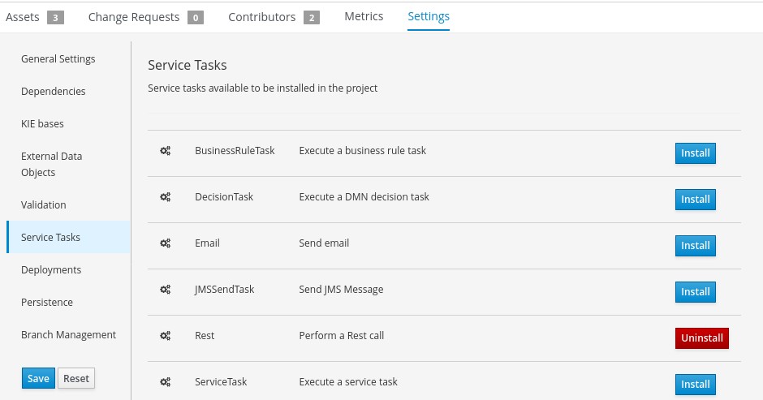
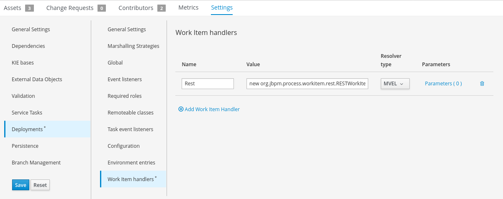
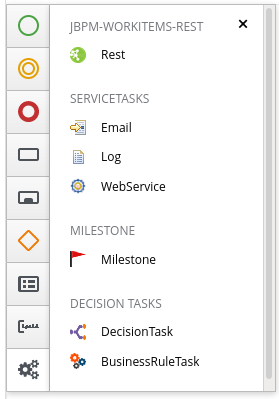
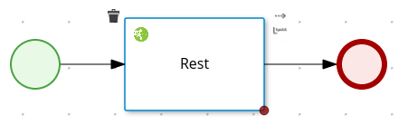
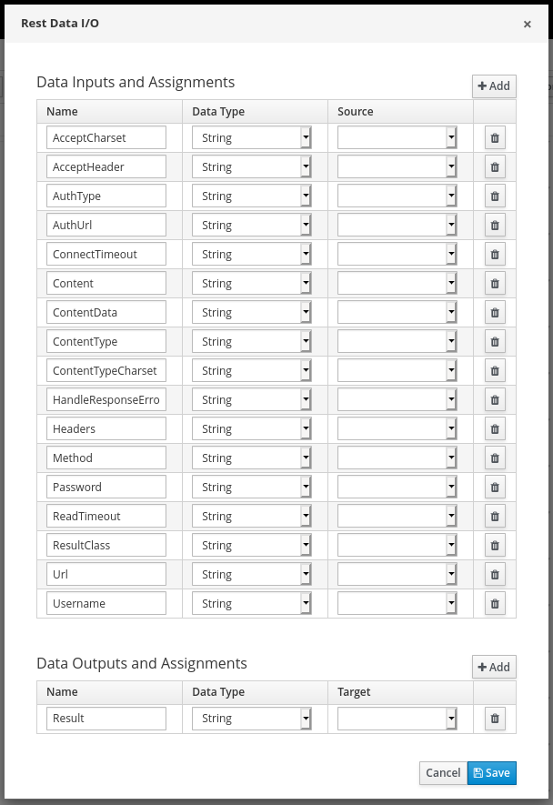

# Work Item Handler (WIH)

## Create a WIH v7 procedure

```sh
mvn archetype:generate \
-DarchetypeGroupId=org.jbpm \
-DarchetypeArtifactId=jbpm-workitems-archetype \
-DarchetypeVersion=7.33.0.Final-redhat-00002 \
-Dversion=1.0.0-SNAPSHOT \
-DgroupId=com.redhat.demo \
-DartifactId=sample-wih \
-DclassPrefix=SampleWorkItem
```

## Create a WIH legacy procedure

Using the Service registry to define a WIH:

[https://docs.jboss.org/jbpm/release/6.5.0.Final/jbpm-docs/html_single/#d0e29362]()

Beside the service registry, you can define a new WIH with the following artefacts:

- create the wid file (just for the editor sake)
- add the dependency in pom.xml
- define it in the kie-deployment-descriptor using the MVEL initialization script e.g. `new org.jbpm.process.workitem.webservice.WebServiceWorkItemHandler(ksession, classLoader)`

Init MVEL parameters:

        ksession
        taskService
        runtimeManager
        classLoader
        entityManagerFactory (no?)
        kieContainer

**Source:** KModuleRegisterableItemsFactory

### Custom icons for WIH

If you add the WIH in `WorkDefinition.wid` the icon should be included in the `global` folder of the project.

Otherwise, if you create another wid file you can add the icon everywhere in the resources folder.


### Wid file to get pre-populated fields:


```
"parameters" : [
...
  "Operation" : new StringDataType(),
...
],
"parameterValues" : [
   "Operation" : "opA,opB,opC"
]
```

or if you have an existing enum class in workbench you could do:

```
"parameterValues" : [
   "Operation" : new EnumDataType("org.jbpm.myenums.MyEnum")
]
```

Reference:

- [https://issues.jboss.org/browse/JBPM-5416]()

# Service Task

* Service implementation: **Java** or **Webservices** (to avoid webservices, because there are more options with "Web Service" WIH)
* Service interface: fully qualified Java class name
* Service operation: name of the method (static method)
* Add a **input** `Parameter` that match the name of method parameter.

Example of method implementation:

```
	public static Object call(Object param) throws Exception {

		return param;
	}
```

## Handling input/output parameters

1. Edit data I/O (assignments)
2. Add the following data input and assignments:


| NAME          | DATA TYPE | SOURCE           |
|---------------|-----------|------------------|
| Parameter     | String    | info             |
| ParameterType | String    | java.lang.String |

3. Add the following data output and assignments:

| NAME          | DATA TYPE | SOURCE           |
|---------------|-----------|------------------|
| Result        | String    | info             |


Internal implementation: 
[https://github.com/kiegroup/jbpm/blob/master/jbpm-bpmn2/src/main/java/org/jbpm/bpmn2/handler/ServiceTaskHandler.java]()

## Work Item Handlers out of the box

    <work-item-handlers>
        <work-item-handler>
            <resolver>mvel</resolver>
            <identifier>new org.jbpm.process.instance.impl.demo.SystemOutWorkItemHandler()</identifier>
            <parameters/>
            <name>Log</name>
        </work-item-handler>
        <work-item-handler>
            <resolver>mvel</resolver>
            <identifier>new org.jbpm.process.workitem.bpmn2.ServiceTaskHandler(ksession, classLoader)</identifier>
            <parameters/>
            <name>Service Task</name>
        </work-item-handler>
        <work-item-handler>
            <resolver>mvel</resolver>
            <identifier>new org.jbpm.process.workitem.webservice.WebServiceWorkItemHandler(ksession, classLoader)</identifier>
            <parameters/>
            <name>WebService</name>
        </work-item-handler>
        <work-item-handler>
            <resolver>mvel</resolver>
            <identifier>new org.jbpm.process.workitem.rest.RESTWorkItemHandler(classLoader)</identifier>
            <parameters/>
            <name>Rest</name>
        </work-item-handler>
    </work-item-handlers>


# Call a REST service

Enable your project to use the REST work item handler (aka Service Task):

1. Open the project **Settings > Service Tasks**
   
   

2. Click **Install** button for the `Rest` service task
3. Insert username and password for the rest basic authentication. You can override those value for a specific call
4. **Save** the configuration

Optionally, check the configuration details in **Settings > Deployment > Work item handlers**



The value for Rest should be:
```java
new org.jbpm.process.workitem.rest.RESTWorkItemHandler("username", "password")
```

## Use the REST Service Task

1. Open or create a new Business Process
2. From the palette select the Service Tasks drawer (the gears icon)
3. Drag and drop the the **REST task** on the process diagram

   

### Configure the assignment

1. Select the **Rest** task 

   

2. From the **Properties** panel select **Assignments** to configure the Rest task behaviour:

   

   **Data Input:**
   
   - Url - resource location to be invoked - mandatory
   - Method - HTTP method that will be executed - defaults to GET
   - ContentType - data type in case of sending data - mandatory for POST,   PUT
   - Content - actual data to be sent - mandatory for POST,PUT
   - ConnectTimeout - connection time out - default to 60 seconds
   - ReadTimeout - read time out - default to 60 seconds</li>
   - Username - user name for authentication - overrides one given on    handler initialization)
   - Password - password for authentication - overrides one given on    handler initialization)
   - AuthUrl - url that is handling authentication (usually    j_security_check url)
   - HandleResponseErrors - optional parameter that instructs handler to    throw errors in case of non successful response codes (other than 2XX)
   - ResultClass - fully qualified class name of the class that response    should be transformed to, if not given string format will be returned
   
   **Data Output:**
   
   - Result: the target **DTO** (a.k.a. *Data Transfer Object*: a Java Object that will be used to map the data send from and by the rest service)

### Other Rest integration details

If you want disregard some json properties, add the following annotation to the Java DTO:

    @org.codehaus.jackson.annotate.JsonIgnoreProperties(ignoreUnknown = true)

This will say to the JSON mapper engine to ignore the JSON properties that are not present in the DTO, otherwise you'll get an exception.

Add the following dependency:

	<dependency>
		<groupId>com.fasterxml.jackson.core</groupId>
		<artifactId>jackson-databind</artifactId>
		<scope>provided</scope>
	</dependency>


### Dealing with the Content Type header property

Usually, REST service should declare how they serialize the data through the Header property `Content-Type` that in most case will assume the following values:

- `application/json`
- `application/xml`

Some REST services return a more complex Content-Type to add more details.

E.g. `Content-Type: application/json;charset=utf-8`

#### Warning information for version 6.4 

Unfortunately, the standard REST Workitem handler (WIH) is not able to handle this situation.
Here you will found a modified version of the WIH that address the problem.

[Improved REST WIH](./samples/wih/rest-wih/README.md)

[Implementation](https://github.com/kiegroup/jbpm/tree/6.5.x/jbpm-workitems/src/main/java/org/jbpm/process/workitem/rest)

### Issues with https

[How do I use the REST Service Task for SSL enabled REST service in BPM Suite 6?](https://access.redhat.com/solutions/3433821)

# Web Services

create a maven project

copy the WSDL in the `resources` folder

create in the project root the `jaxb-bindings.xml` with the following content:

    <?xml version="1.0" encoding="UTF-8"?>
    <xs:schema xmlns:xs="http://www.w3.org/2001/XMLSchema"
    	xmlns:jaxb="http://java.sun.com/xml/ns/jaxb" xmlns:xjc="http://java.sun.com/xml/ns/jaxb/xjc"
    	elementFormDefault="qualified" attributeFormDefault="unqualified"
    	jaxb:extensionBindingPrefixes="xjc" jaxb:version="1.0">
    	<xs:annotation>
    		<xs:appinfo>
    			<jaxb:globalBindings>
    				<xjc:serializable />
    			</jaxb:globalBindings>
    		</xs:appinfo>
    	</xs:annotation>
    </xs:schema>

launch wsconsume.sh

    $ <EAP_HOME>/bin/wsconsume.sh -b jaxb-bindings.xml -k -n -s src/main/java/ src/main/resources/POCJBSS.WSDL
    $ rm -rf output

### parameters

  - URL = http url for WSDL
  - endpoint = `location` of `soap:address`
  - mode = `SYNC`
  - interface = `name` of `portType`
  - operation = `name` of `operation`
  - namespace = `targetNamespace`

### Not wrapped types

Some webservices uses bare type (not wrapped), so in order to match the service signature you have to transform the wrapper class in an object's array.

    requestArray = new Object[] {
    	request.getField1(),
    	request.getField2(),
    	request.getField3()
    };

### self signed certificate problem

Workaround?

https://erikwramner.wordpress.com/2013/03/27/trust-self-signed-ssl-certificates-and-skip-host-name-verification-with-jax-ws/

# Email

Test emails:

[Fake SMTP server/client](https://nilhcem.github.io/FakeSMTP/)


## Send Mail Task
Configure at project level the WorkitemHandler:

- Open Project Editor > Deployment Descriptor

		new org.jbpm.process.workitem.email.EmailWorkItemHandler("localhost", "8086","me@localhost","password")

## Human task notifications

Detailed information in: [Human Tasks](human_tasks.md)

# EJB

https://access.redhat.com/solutions/396853#eap6client

https://github.com/selrahal/jbpm-rest


Event emitters
===============================================================

The most effective way to store the runtime events is to leverage the event emitters.

[NoSQL enters jBPM ... as an experiment ... so far](http://mswiderski.blogspot.com/2017/08/nosql-enters-jbpm-as-experiment-so-far.html)
[Elasticsearch empowers jBPM](http://mswiderski.blogspot.com/2017/08/elasticsearch-empowers-jbpm.html)