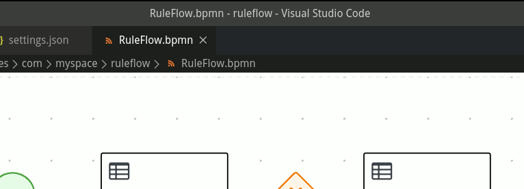

Kogito
=========================================================

Kogito tooling
---------------------------------------------------------

Installation from: [github release](https://github.com/kiegroup/kogito-tooling/releases)

In order to enable the code:

```sh
sudo vi /usr/bin/code
```

Change this line:

```sh
ELECTRON_RUN_AS_NODE=1 "$ELECTRON" "$CLI" "--enable-proposed-api" "kiegroup.vscode-extension-pack-kogito-kie-editors" "$@"
```

### Open with text editor


