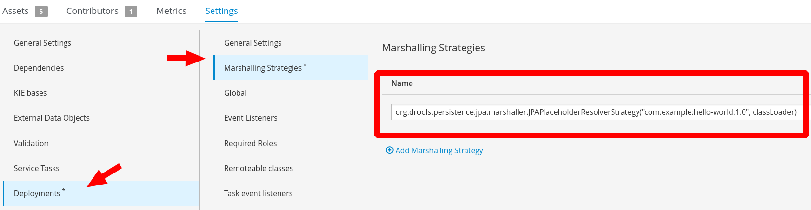
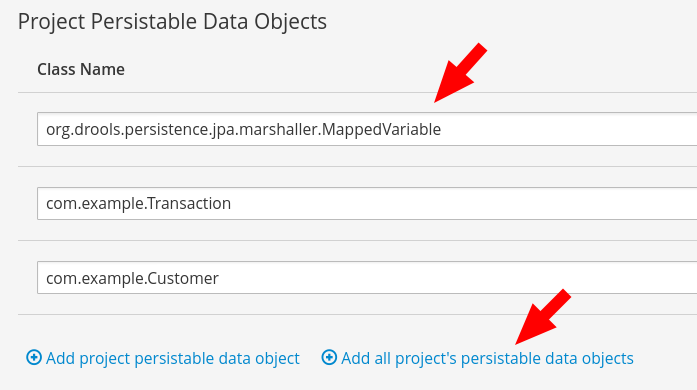

Track SLA
===========================================================================

From RHPAM 7.0.2

Each task and the overall process have a new property: `SLA Due Date`

Example of date expression:

- 5m 

SLA compliance levels:

  - N/A - when there is no SLA due date (integer value 0)
  - Pending - when instance is active with due date set (integer value 1)
  - Met - when instance was completed before SLA due date (integer value 2)
  - Violated - when instance was not completed/aborted before SLA due date (integer value 3)
  - Aborted - when instance was aborted before SLA due date (integer value 4)

### References:

- [Track your processes and activities with SLA](http://mswiderski.blogspot.com/2018/02/track-your-processes-and-activities.html)

Process Instances Migration
===========================================================================

Official Documentation:

[Process Instance Migration](https://access.redhat.com/documentation/en-us/red_hat_jboss_bpm_suite/6.4/html/development_guide/chap_human_tasks_management#process_instance_migration)

Limitations:

[Process instance migration limitations](https://access.redhat.com/solutions/3599791)

[Fix for case management](https://issues.jboss.org/browse/JBPM-7230)


Asynchronous Jobs
===========================================================================

Some findings:

1. If you specify "Is Async" for a task, it is executed in another thread by the executor
2. if the service get an runtime exception the executor repeat the execution for 3 times, then it puts the job in error state
3. in the Jobs page (Deploy > Jobs), you can find the job in the error tab.
4. the user can requeue the job, so the executor tries again the job execution.
5. from the Jobs page, you can stop and start the Executor, change the frequency and the threads (I think that it is implemented with a polling logic over the DB)
6. If I stop the executor and launch a new process, for some strange reason the job is executed (regardless the executor stop status!) but if the service raise an exception, it is marked as "retrying" and is not processed again till the executor is started again

Asynchronous Workitems
===========================================================================

[make-your-work-asynchronous](http://mswiderski.blogspot.it/2013/08/make-your-work-asynchronous.html)

A process can have two kinds of asynchronous tasks:
Task with the "Is Async" property set to true - this generates a proxy called "AsyncSignalEventCommand" (an asynchronous job) that is charge to execute the task. In this case, when the job is executed the actual process instance variables are retrieved and passed to the synchronous WorkItemHandler implementation.
Task with an [AsyncWorkItemHandler][1] Implementation (or the command pattern) - in this case an asynchronous job is generated with the input payload serialized at creation time. When the job is executed the payload is always the same regardless the actual values of process variables.

[How do I use job executor from a task in JBoss BPM Suite 6.1?](https://access.redhat.com/solutions/2142501)

The 2nd option is to register different instances of `AsyncWorkItemHandler` for different work items.

>To register such handlers for jbpm console or kie-wb additional class is required to inform what shall be registered. A CDI bean that implements WorkItemHandlerProducer interface needs to be provided and placed on the application classpath so CDI container will be able to find it. Then at modeling time TaskName property needs to be aligned with those used at registration time.

**To be clarified: ** Why does it need a new `WorkItemHandlerProducer` to register another implementation of `AsyncWorkItemHandler`? Maybe a traditional workitem registration is enough?

[Introduction to CDI Dependency Injection](https://dzone.com/articles/cdi-di-p1)
[WorkItemHandlerProducer interface](https://github.com/kiegroup/droolsjbpm-knowledge/blob/master/kie-internal/src/main/java/org/kie/internal/runtime/manager/WorkItemHandlerProducer.java)

[1]: https://github.com/droolsjbpm/jbpm/blob/master/jbpm-services/jbpm-executor/src/main/java/org/jbpm/executor/impl/wih/AsyncWorkItemHandler.java

## Registering Manually  

In general, what is most likely happening is that you are registering handler manually via kie session and in case you use runtime manager and strategy other than singleton it will be not visible by other contexts. Looks like you are using per process instance strategy which would explain why it fails after starting subprocess - it gets new context - new kie session without handler being registered there. So you need to use RegisterableItemsFactory for registering handlers. That is set on RuntimeEnvironment used to create runtime manager, see here:
https://github.com/kiegroup/jbpm/blob/master/jbpm-services/jbpm-executor/src/test/java/org/jbpm/executor/impl/wih/AsyncContinuationSupportTest.java#L155-L169


Executor configuration
============================================

Executor can work with or without JMS.
JMS is the preferred option but executor can work without it and it does for instance on Tomcat where there is no JMS provider out of the box.
you can disable JMS executor by system property `org.kie.executor.jms=false`

[How can I increase the number of running jobs using the JMS based executor in BPM Suite 6](https://access.redhat.com/solutions/3003791)

1. Increase the number of maxSession for the executor MDB (JmsAvailableJobsExecutor) in business-central.war/WEB-INF/ejb-jar.xml, the mdb pool size and also the number of connections for the connection for JmsXA connection factory.
2. Increase the EJB pool size for MDBs
3. Increase the JmsXA connection factory thread pool size

Kie session persistence
--------------------------------------------

The persistence of the kie session (ksession) is determined by the runtime strategy chosen:

- `SINGLETON` (default): there is only one kie session per container in the KIE Server. The kie session is stored in the DBMS but the kie session identifier is stored in a file.
- `PER_REQUEST`: every request/transaction to a KIE Server gets a new kie session, which is disposed of at the end of the request/transaction.
- `PER_PROCESS_INSTANCE`: a kie session is bound to the lifetime of the process instance, and persisted to the database.
- `PER_CASE_INSTANCE`: the kie session is shared across multiple process instances that compose a case instance (the life cycle follow the case instance one) 

Deployment Descriptor
============================================

While kmodule is mainly targeting on knowledge base and knowledge session basic configuration, deployment descriptors are considered more technical configuration. Following are the items available for configuration via deployment descriptors:


  * persistence unit name for runtime data
  * persistence unit for audit data
  * persistence mode (JPA or NONE)
  * audit mode (JPA, JMS, NONE)
  * runtime strategy (SINGLETON, PER_REQUEST, PER_PROCESS_INSTANCE)
  * list of event listeners to be registered
  * list of task event listeners to be registered
  * list of work item handlers to be registered
  * list of globals to be registered
  * marshalling strategies to be registered (for pluggable variable persistence)
  * required roles to be granted access to resources of the kjar
  * additional configuration options of knowledge session
  * additional environment entries for knowledge session
  * list of fully qualified class names that shall be added to the classes used for serialization by remote services
  * whether or not to limit the classes from the deployment used for serialization by the remote services

[https://docs.jboss.org/jbpm/release/6.5.0.Final/jbpm-docs/html/ch14.html#d0e15405]()


JPA variable persistence
============================================

RHPAM can store the process variable in a relational table leveraging JPA.

**Warning** Business Central till version 7.1.1 lacks of some libraries that support the JPA variable persistence. In order to work around this you have to copy from kie-server libs the followings:

 - drools-persistence-api-7.11.0.Final-redhat-00004.jar
 - drools-persistence-jpa-7.11.0.Final-redhat-00004.jar


This is the procedure to achieve such result:

1. Add dependency to `drools-persistence-jpa` (unfortunately this cannot be done in business central since you have to add `provided` as scope)

		<dependency>
			<groupId>org.drools</groupId>
			<artifactId>drools-persistence-jpa</artifactId>
			<version>7.11.0.Final-redhat-00004</version>
			<scope>provided</scope>
		</dependency>

2. Configure the *Data Object* as *Persistable*.

	

	- **EXTRA CONFIGURATION** the data object MUST extend `org.drools.persistence.jpa.marshaller.VariableEntity`


3. Then you have to configure the *Persistence descriptor*:


	- In the **Settings** section of the project, select the **Persistence** tab. 
	
	
	
	- Take note of the **Persistence Unit** name
	- Make sure that the Data Object is enlisted among the **Pesistable Data Object**
	- Add this class: `org.drools.persistence.jpa.marshaller.MappedVariable`

	
 
4. Edit the `kie-deployment-descriptor.xml`

	- add the marchalling strategy JPAPlaceholderResolverStrategy. it requires 2 parameters the persistence unit name and the class loader.

    ```xml
		<marshalling-strategies>
		    <marshalling-strategy>
		        <resolver>mvel</resolver>
		        <identifier>new org.drools.persistence.jpa.marshaller.JPAPlaceholderResolverStrategy("com.myspace:processes:1.0.0", classLoader)</identifier>
		        <parameters/>
		    </marshalling-strategy>
		</marshalling-strategies>
    ```


**BE AWARE** the table that map the data object is in the same BPM datasource.

*Final doubt:* In some example I found that the persisted data object are even declared remoteable classes in the `kie-deployment-descriptor.xml`. At the moment, I'm not aware of actual benefit of such configuration.

```xml
<remoteable-classes>
  <remoteable-class>com.sample.Customer</remoteable-class>
  <remoteable-class>org.drools.persistence.jpa.marshaller.VariableEntity</remoteable-class>
</remoteable-classes>
```

**Configuration for form rendering:** Using a JPA Variable in a form lead to a problem when it's used in a form. The user get the following exception: `com.thoughtworks.xstream.security.ForbiddenClassException`. **Solution:** add the following system property:

```xml
    <property name="org.kie.server.xstream.enabled.packages" value="org.drools.persistence.jpa.marshaller.*"/>
```

#### Troubleshooting

If you find this error in the BC means that you lack the libraries (Check first point of the procedure).

	warning `Could not compile mvel expression 'new org.drools.persistence.jpa.marshaller.JPAPlaceholderResolverStrategy("com.garanti:test-pers:1.0.0", classLoader)'. this can be due to invalid syntax of missing classes-[Error: Failed to link org/drools/persistence/jpa/marshaller/JPA...`

If you get this error at deployment time, it could be caused by an wrong persistence description.

```java
ERROR [org.kie.server.services.jbpm.JbpmKieServerExtension] (default task-21) Error when creating container XYZ by extension jBPM KIE Server extension: java.lang.RuntimeException: [Error: could not create constructor: null]
[Near : {... new org.drools.persistence.jpa.mar ....}]
                 ^
[Line: 1, Column: 5]
	at org.jbpm.kie.services.impl.KModuleDeploymentService.deploy(KModuleDeploymentService.java:214)
```

E.g. you have a one to many relationship not defined.

```java
@ElementCollection // <- this create a side table with suppliers (orderid, supplier)
private java.util.List<java.lang.String> suppliersList;
```


## References

[jBPM 6 - store your process variables anywhere](http://mswiderski.blogspot.it/2014/02/jbpm-6-store-your-process-variables.html)

Signals
============================================

To enable the external signals:

1. Enable `KIE.SERVER.SIGNAL.QUEUE` in `kie-server.war/META-INF/kie-server-jms.xml`
2. Enable ejb `org.jbpm.process.workitem.jms.JMSSignalReceiver` in `kie-server.war/WEB-INF/ejb-jar.xml`
3. In the project add the following dependency:
   ```xml
    <dependency>
      <groupId>org.jbpm</groupId>
      <artifactId>jbpm-workitems-jms</artifactId>
      <version>7.23.0.Final-redhat-00003</version>
      <scope>provided</scope>
    </dependency>
   ```

4. In the `kie-deployment-descriptor` add the work item handler definition:

   ```xml
    <work-item-handler>
        <resolver>mvel</resolver>
        <identifier>new org.jbpm.process.workitem.jms.JMSSendTaskWorkItemHandler("java:/JmsXA", "java:jboss/exported/jms/queue/KIE.SERVER.SIGNAL")</identifier>
        <parameters/>
        <name>External Send Task</name>
    </work-item-handler>
   ```

## References

[Improved Signaling](http://mswiderski.blogspot.com/2015/09/improved-signaling-in-jbpm-63.html)

Advanced Queries
============================================

Register an Advanced Query through the Business Central
-------------------------------------------------------

Advanced Queries can be registered directly from Business Central:

1. Open **Settings** (the top right wheel gear)
2. Select **Data Sets** tile
3. Click **New Data Set**
4. Select **Execution Server** as *provider type*
5. In the **Data Set Creation Wizard** fill in the following data

   - name: `getAllProcesses`
   - server configuration: `default-server` (this name depends on the execution server configuration discovered)
   - query target: `PROCESS`
   - query: `select * from PROCESSINSTANCELOG`

6. Take note of the UUID (e.g. `93456998-d4aa-4a53-a9b5-4cfd4b3cf03a`)
7. Click **Test** to see the query result

Use the Advanced Query through a REST client
-------------------------------------------------------

The simpler way to test the Kie Server APIs is using the Swagger UI, reachable at the following address: `http://localhost:8080/kie-server/docs`

1. Look for the section **Custom queries**
2. Expand **GET** `/server/queries/definitions/{queryName}/data`
3. Click **Try it out** and fill with following data:

   - queryName: the UUID generated previously (e.g. `93456998-d4aa-4a53-a9b5-4cfd4b3cf03a`)
   - mapper: `ProcessInstances`

4. Click **Execute**

Valid input for **mapper** : `ProcessInstances`, `ProcessInstancesWithVariables`, `ProcessInstancesWithCustomVariables`, `UserTasks`, `UserTasksWithVariables`, `RawList`, `TaskSummaries`, `UserTasksWithCustomVariables`, `ExecutionErrors`, `UserTasksWithModifications`, `UserTasksWithPotOwners`, `ProcessInstancesCustom`;

Use the Advanced Query through a Java REST client
-------------------------------------------------------

Create a Java project and add the following dependencies:

```xml
		<dependency>
			<groupId>org.kie.server</groupId>
			<artifactId>kie-server-client</artifactId>
		</dependency>
		<dependency>
			<groupId>org.jbpm</groupId>
			<artifactId>jbpm-kie-services</artifactId>
		</dependency>
```

A full demo of an Advanced Query client project is available here:

https://github.com/dmarrazzo/rhpam7-order-management-demo-collaterals

The code to retrieve the process instance list:

```java
List<ProcessInstance> piList = queryClient.query("f49bc778-4883-4295-b391-6454fe64e42b",
					QueryServicesClient.QUERY_MAP_PI, 0, 10, ProcessInstance.class);
```

Embed the Advanced Query in the Project
-------------------------------------------------------

It's possible to deploy one or more advanced queries along with the project (kjar):

1. Create a *JSON* file in this project location `src/main/resources/query-definitions.json` with the following content

    ```json
    [
        {
          "query-name": "getAllProcessesEmbedded",
          "query-source": "${org.kie.server.persistence.ds}",
          "query-expression": "select * from PROCESSINSTANCELOG",
          "query-target": "PROCESS",
          "query-columns": {}
        }
    ]
    ```
    In case of doubt about the content, it's possible to retrieve existing query definition via REST APIs.

2. Deploy the Project

**Note** in the server log you should see the following information:

```log
16:09:42,383 INFO  [org.jbpm.kie.services.impl.query.persistence.PersistDataSetListener] (default task-15) Data set getAllProcessesEmbedded saved in db storage
16:09:42,384 INFO  [org.kie.server.services.jbpm.JbpmKieServerExtension] (default task-15) Data source expression ${org.kie.server.persistence.ds} resolved to java:jboss/datasources/ExampleDS
16:09:42,384 INFO  [org.jbpm.kie.services.impl.query.QueryServiceImpl] (default task-15) Registered getAllProcessesEmbedded query successfully
```

Usage Examples
-------------------------------------------------------

The following examples are based on the following PAM v7.5 project:

[Red Had Process Automation Manager - Order Management Demo](https://github.com/jbossdemocentral/rhpam7-order-management-demo-repo)

This project has a JPA Persisted Process Variable that can be used to filter processes and tasks.

The table mapping the variable is **OrderInfo** with these columns: orderId, item, category, urgency, price, managerApproval, rejectionReason, targetPrice.
 
**MAPPEDVARIABLE** is a bridge table to link task instances and process instances to the variable id.

Here the mapping column: 

- MAPPEDVARID: unique id (generated - do not use for join)
- PROCESSINSTANCEID: process instance id
- TASKID: task instance id
- VARIABLEID: variable instance id
- VARIABLETYPE: class name of the Java class
- OPTLOCK: used internally
- WORKITEMID: workitem instance id 
- MAP_VAR_ID: unique id = VARIABLEID (?)

### Processes with a custom variable

- Register the following advanced query:

  ```sql
  SELECT DISTINCT pil.PROCESSINSTANCEID, pil.PROCESSID, pil.START_DATE, pil.END_DATE, pil.STATUS, pil.PARENTPROCESSINSTANCEID, pil.OUTCOME, pil.DURATION, pil.USER_IDENTITY, pil.PROCESSVERSION,pil.PROCESSNAME, pil.CORRELATIONKEY, pil.EXTERNALID, pil.PROCESSINSTANCEDESCRIPTION, pil.SLA_DUE_DATE, pil.SLACOMPLIANCE, oi.item, oi.category, oi.urgency, oi.price, oi.managerApproval, oi.rejectionReason oi.targetPrice
  FROM PROCESSINSTANCELOG pil
  INNER JOIN MAPPEDVARIABLE mv ON pil.PROCESSINSTANCEID = mv.PROCESSINSTANCEID
  INNER JOIN ORDERINFO oi ON oi.ID = mv.VARIABLEID
  ```

- Extract all processes with related process variable:

  ```java
  QueryFilterSpec spec = new QueryFilterSpecBuilder().addColumnMapping("ITEM", "string")
                                                     .addColumnMapping("CATEGORY", "string")
                                                     .addColumnMapping("PRICE", "double")
                                                     .get();
  List<ProcessInstance> piList = queryClient.query("08c36362-9c71-4327-aab7-680573d1fdb2",
          QueryServicesClient.QUERY_MAP_PI_WITH_CUSTOM_VARS, spec, 0, 10, ProcessInstance.class);
  piList.forEach(pi -> { System.out.format("pi %s vars: %s", pi, pi.getVariables()); });
  ```
  
  Queries using query definition identified by queryName. Maps the result to concrete objects based on provided mapper. Query is additional altered by the filter spec and/or builder.

- Plain REST request
  
  POST request to `http://localhost:8080/kie-server/services/rest/server/queries/definitions/08c36362-9c71-4327-aab7-680573d1fdb2/filtered-data?mapper=ProcessInstancesWithCustomVariables&page=0&pageSize=10`
  
  Payload:
  
  ```json
  {
    "order-by" : null,
    "order-asc" : false,
    "query-params" : null,
    "result-column-mapping" : {
      "ITEM" : "string",
      "PRICE" : "double",
      "CATEGORY" : "string"
    },
    "order-by-clause" : null
  }
  ```

- To filter the results leverage the `QueryFilterSpecBuilder` in the following way:

  ```java
  QueryFilterSpec spec = new QueryFilterSpecBuilder().equalsTo("CATEGORY", "basic")
                                                     .between("PRICE", 800, 1200)
                                                     .get();
  ```

### Task with input variable

taskId,
status,
activationTime,
name,
description,
priority,
actualOwner,
createdBy,
deploymentId,
processId,
processInstanceId,
createdOn,
dueDate
workItemId

### Retrieving list of tasks with process variables

In general, a task should contain all the context information that are needed to be performed, so it's reasonable that from user perspective is usually enough to search tasks based on their input variable (input assignment in the process designer). 
Nevertheless, there is an extremely flexible way to en-query the database getting just RAW data:

Create the following advanced query:

```sql
select distinct t.id, t.name,  oi.item, oi.category, oi.urgency, oi.price, oi.targetprice
from Task t inner join (select mv.map_var_id, mv.processinstanceid from MappedVariable mv) mv 
on (mv.processinstanceid = t.processinstanceid) inner join OrderInfo oi on (oi.id = mv.map_var_id)
```

From java rest client:

```java
			List<List> rawList = queryClient.query("fe375037-8da7-43c3-a0d9-28051c39fb9c",
					QueryServicesClient.QUERY_MAP_RAW, 0, 10, List.class);
```

Curl:

```sh
curl -X GET "http://localhost:8080/kie-server/services/rest/server/queries/definitions/fe375037-8da7-43c3-a0d9-28051c39fb9c/data?mapper=RawList&page=0&pageSize=10" -H "accept: application/json"
```

## References

[Advanced Queries in jBPM](http://mswiderski.blogspot.it/2016/01/advanced-queries-in-jbpm-64.html)

[Advanced queries in KIE Server](http://mswiderski.blogspot.it/2016/01/advanced-queries-in-kie-server.html)

[Data set editor for KIE Server custom queries](http://mswiderski.blogspot.com/2018/04/data-set-editor-for-kie-server-custom.html)


Correlation Key
============================================

Technically you probably can create a correlation key afterwards, it's basically an entry in the database that links both.  But in the public api it's only exposed when starting a process.  Using internal apis you can probably create a CorrelationKeyInfo object and persist it.  

correct, you should be able to create it and persist, though that does not much change compared to using variable. If I may ask why not assigning correlation key directly?

<https://github.com/kiegroup/jbpm/blob/d881f2a72bd4279d4277b294c2dbc6663d91c612/jbpm-persistence/jbpm-persistence-jpa/src/main/java/org/jbpm/persistence/processinstance/JPAProcessInstanceManager.java#L73-L91>

Tracking the loops
============================================

-Djbpm.loop.level.disabled=true
this loop level is to track different loops over the same constructs in your process. But it capable of tracking them if they are properly structured - so called structured loops.

it’s enabled by default as when you do proper process design around loops this will allow you to isolate them and keep track on the engine level properly. Potential side effect is that it will trigger incorrect nodes if you do have structured loops in your process and multiple instances of given loop is active at the same time.

Classloading
============================================

[Can we change a project classloading precedence in JBoss BPM Suite 6?](https://access.redhat.com/node/1414423/)

[How does JBoss BPM Suite 6 maven dependencies classloading work?](https://access.redhat.com/solutions/1588343)

## DataObjects and remote API

If you are creating a data object, make sure that the class has the `@org.kie.api.remote.Remotable` annotation. The `@org.kie.api.remote.Remotable` annotation makes the entity available for use with JBoss BPM Suite remote services such as REST, JMS, and WS.

Upon deployment, jbpm will scan classpath of given kjar to automatically register classes that might be needed for remote interaction. This is done based on following rules:

- all classes included in kjar project itself
- all classes included as dependency of projects type kjar
- classes that are annotated with @XmlRootElement (JAXB annotation) and included as regular dependency of the kjar
- classes that are annotated with @Remotable (kie annotation) and included as regular dependency of the kjar

If that is not enough deployment descriptor allows to manually specify classes that shall be added to the JAXB context via remoteable-classes element:

    <remoteable-classes>
       ...
       <remotable-class>org.jbpm.test.CustomClass</remotable-class>
       <remotable-class>org.jbpm.test.AnotherCustomClass</remotable-class>
       ...
    </remoteable-classes>
    
With this all classes can be added to the JAXB context to properly marshal and unmarshal data types when interacting with jBPM remotely.

Audit 
============================================

## Separate Runtime and BAM data

[https://issues.jboss.org/browse/JBPM-5211]()

## Log limit for variable 255

It's possible to define the variable maximum length, e.g.:

	<property name="org.jbpm.var.log.length" value="1000"/>

DB Schema must be update accordingly.

## JMS Audit

setting system property

    -Djbpm.audit.jms.enabled=true

File `jbpm.audit.jms.properties` needs to be placed on application classpath (kie-server.war/WEB-INF/classes) as it’s a global setting

```
jbpm.audit.jms.connection.factory.jndi=java:/JmsXA
jbpm.audit.jms.queue.jndi=queue/KIE.AUDIT.ALL
```
For WebLogic AS add: `jbpm.audit.jms.transacted=false` 

[https://access.redhat.com/solutions/3301681]()

Log producer: 

[https://github.com/kiegroup/jbpm/blob/master/jbpm-audit/src/main/java/org/jbpm/process/audit/jms/AsyncAuditLogProducer.java]()

Task not implemented
============================================

Although the BPMN Editor has almost all BPMN task in the palette. Not all are implemented by the runtime.

Missing implementation:

- Messages related nodes (the BPMN spec is not clear on how to implement) **See: Signals**
- Send Task and Receive Task
- Manual Task

The process developer can fill the gap providing the implementation for this tasks through the standard work item handler registration mechanism.

Dummy implementation: s

        <work-item-handler>
            <resolver>mvel</resolver>
            <identifier>new org.jbpm.bpmn2.handler.ReceiveTaskHandler(ksession)</identifier>
            <parameters/>
            <name>Receive Task</name>
        </work-item-handler>
        <work-item-handler>
            <resolver>mvel</resolver>
            <identifier>new org.jbpm.bpmn2.handler.SendTaskHandler()</identifier>
            <parameters/>
            <name>Send Task</name>
        </work-item-handler>

## References

[When using Send Task or Receive Task in a BPMN2 process definition with BPMS 6 it gives the ERROR "Could not find work item handler for Send Task"](https://access.redhat.com/solutions/1223443)

[Send Task and Receive Task of a BPMN2 process do not work when they are used in different processes as the latter process seems to be waiting for the message to arrive](https://access.redhat.com/solutions/1243573)


Quartz
============================================

RHPAM uses quartz to manage timers in a cluster environment (the other option is to use EJB timers in a EAP cluster).

The following query extract the quartz jobs linked to a specific process instance id:

```sql
select processId, count(*)
from (
select substr(job_name, 10, 6) processId
from bpms.qrtz_triggers)
group by processId
having count(*) > 1
order by processId
```


References
--------------------------------------------

[Configuring the business application for a cluster using Quartz](https://access.redhat.com/documentation/en-us/red_hat_process_automation_manager/7.3/html-single/creating_red_hat_process_automation_manager_business_applications_with_spring_boot/index#bus-app-quartz_business-applications)

[QuartzSchedulerService](https://github.com/kiegroup/jbpm/blob/master/jbpm-flow/src/main/java/org/jbpm/process/core/timer/impl/QuartzSchedulerService.java#L99)

Issues
============================================


## PerProcessInstanceRuntimeManager

https://access.redhat.com/solutions/1183403


## Error deserializing process instance

If you get the following exception, trying to abort a process instance:

```
java.io.IOException: Error deserializing process instance.
	at org.jbpm.marshalling.impl.AbstractProtobufProcessInstanceMarshaller.readProcessInstance(AbstractProtobufProcessInstanceMarshaller.java:479)

```

It's likely that you have in your Java model a reference to a class that is not present in the classpath.

In fact, you should find down in the stack trace, the evidence of the missing class:

```
Caused by: java.lang.ClassNotFoundException: org.slf4j.impl.Slf4jLogger
	at java.lang.ClassLoader.findClass(ClassLoader.java:530)
	at java.lang.ClassLoader.loadClass(ClassLoader.java:424)
	at org.drools.core.common.ProjectClassLoader$DefaultInternalTypesClassLoader.loadType(ProjectClassLoader.java:394)
	at org.drools.core.common.ProjectClassLoader.loadType(ProjectClassLoader.java:172)
```

## IsImmediate property

It's not used by the runtime engine.
