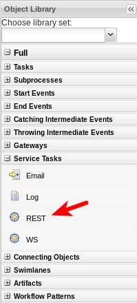
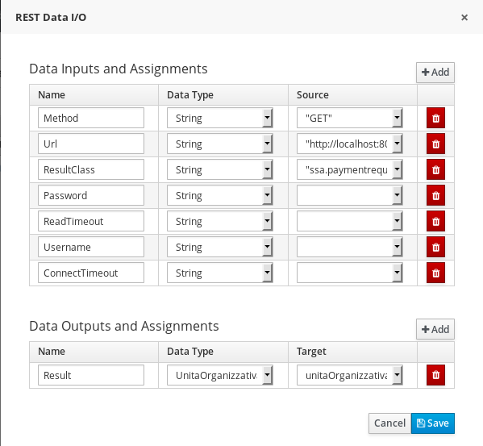

# Call REST service

Use the REST Workitem

## Configure the assignment
Data Input:

- Url - resource location to be invoked - mandatory
- Method - HTTP method that will be executed - defaults to GET
- ContentType - data type in case of sending data - mandatory for POST,PUT
- Content - actual data to be sent - mandatory for POST,PUT
- ConnectTimeout - connection time out - default to 60 seconds
- ReadTimeout - read time out - default to 60 seconds</li>
- Username - user name for authentication - overrides one given on handler initialization)
- Password - password for authentication - overrides one given on handler initialization)
- AuthUrl - url that is handling authentication (usually j_security_check url)
- HandleResponseErrors - optional parameter that instructs handler to throw errors in case of non successful response codes (other than 2XX)
- ResultClass - fully qualified class name of the class that response should be transformed to, if not given string format will be returned

Data Output:

- Result: the target DTO

**DTO** stands for *Data Transfer Object*: a Java Object that will be used to map the data send from and by the rest service.

If you want disregard some json properties, add the following annotation to the Java DTO:

    @org.codehaus.jackson.annotate.JsonIgnoreProperties(ignoreUnknown = true)

This will say to the JSON mapper engine to ignore the JSON properties that are not present in the DTO, otherwise you'll get an exception.

## Dealing with the Content Type header property
Usually, REST service should declare how they serialize the data through the Header property `Content-Type` that in most case will assume the following values:

- `application/json`
- `application/xml`

Some REST services return a more complex Content-Type to add more details.

E.g. `Content-Type: application/json;charset=utf-8`

Unfortunately, the standard REST Workitem handler (WIH) is not able to handle this situation.
Here you will found a modified version of the WIH that address the problem.

[Improved REST WIH](./samples/wih/rest-wih/README.md)

