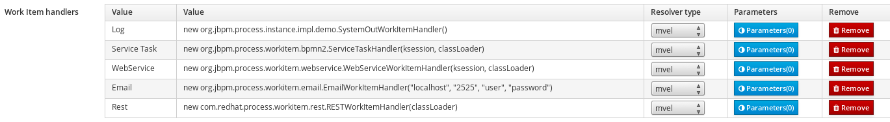

# REST Workitem Handler
Small change to the original to handle complex content type
E.g. application/json;charset=utf-8

## Installation

Build the project and place in the Business Central `WEB-INF/lib`

## Configure the new workitem

Open the project editor, then the Deployment Descriptor editor.
Scroll till the Work Item handlers section and update the Rest raw with the following:

- `new com.redhat.process.workitem.rest.RESTWorkItemHandler(classLoader)`

