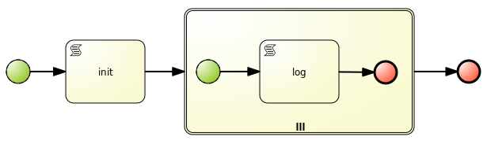
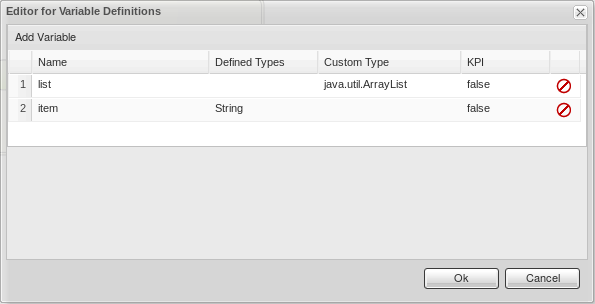
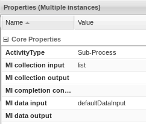

# Subprocesses

## Multiple instance

This construct is really useful to model a repeatable logic that should iterate over a bunch of values (a list). Let's look at this simple process:



Here the variables:



The init task initialize the list:

    System.out.println("init " + list);

    list = new java.util.ArrayList<String>();
    list.add("str1");
    list.add("str2");
    list.add("str3");

    kcontext.setVariable("list",list);

Let's see how to configure the multiple instance node:



**Note** for a bug MI data input is not editable. After a save the editor automatically set it to `defaultDataInput`.

Inside the script node you can access to the variable of that iteration, here the code:

    System.out.println("log: "+ defaultDataInput);

Run the process and you'll see the following log output:

    20:07:53,653 INFO  [stdout] (http-127.0.0.1:8080-1) init null
    20:07:53,664 INFO  [stdout] (http-127.0.0.1:8080-1) log: str1
    20:07:53,675 INFO  [stdout] (http-127.0.0.1:8080-1) log: str2
    20:07:53,681 INFO  [stdout] (http-127.0.0.1:8080-1) log: str3

It work as designed!

## Call a subprocess dynamically from a script

```java
kcontext.getKieRuntime().startProcess(processId, params);
```

[Full example](https://github.com/dmarrazzo/rhpam-dynamic-subprocesses)


### Call a process when runtime strategy is not singleton

```java
String deploymentId = (String) kcontext.getKieRuntime().getEnvironment().get("deploymentId");

ProcessService processService = (ProcessService) ServiceRegistry.get().service(ServiceRegistry.PROCESS_SERVICE);
Long processInstanceId = processService.startProcess(deploymentId, processId, params);
```

## Call a reusable subprocess from other project

1. Create a Reusable Project, which will include Reusable sub process. Make sure that the `kbase` and `ksession` configured for this project will not be default.
   
   `kmodule.xml`

   ```xml
   <kmodule xmlns="http://jboss.org/kie/6.0.0/kmodule"; xmlns:xsi="http://www.w3.org/2001/XMLSchema-instance">;
       <kbase name="kbase" default="false" eventProcessingMode="stream" equalsBehavior="identity" packages="*">
           <ksession name="ksession" type="stateful" default="false" clockType="realtime"/>
       </kbase>
   </kmodule>
   ```

2. Create Parent Project, which will include Parent process, make sure that the kbase and ksession configured for this project will be default.

   `kmodule.xml`

   ```xml
   <kmodule xmlns="http://jboss.org/kie/6.0.0/kmodule"; xmlns:xsi="http://www.w3.org/2001/XMLSchema-instance">;
     <kbase name="kbase-top" default="true" eventProcessingMode="stream" equalsBehavior="identity" packages="*" includes="kbase">
       <ksession name="ksession-top" type="stateful" default="true" clockType="realtime"/>
     </kbase>
   </kmodule>
   ```

3. Edit pom.xml of this Parent project and add dependency of the ReUsable project.

4. Alter `kmodule.xml` of Parent project so it includes the knowledge base of the ReUsable project - please notice the keyword `includes` in the above `kmodule.xml`

### Reference
[http://mswiderski.blogspot.it/2015/01/multiinstance-characteristic-example.html]()

###Glitch found

For some strange reason if you don't specify a form, BPMS autogenerate it for you. It can be useful in some cases, but in this example it initiate `init` as `String` with unexpected cast exception at runtime. You can work around this generating a void start form for the process!
